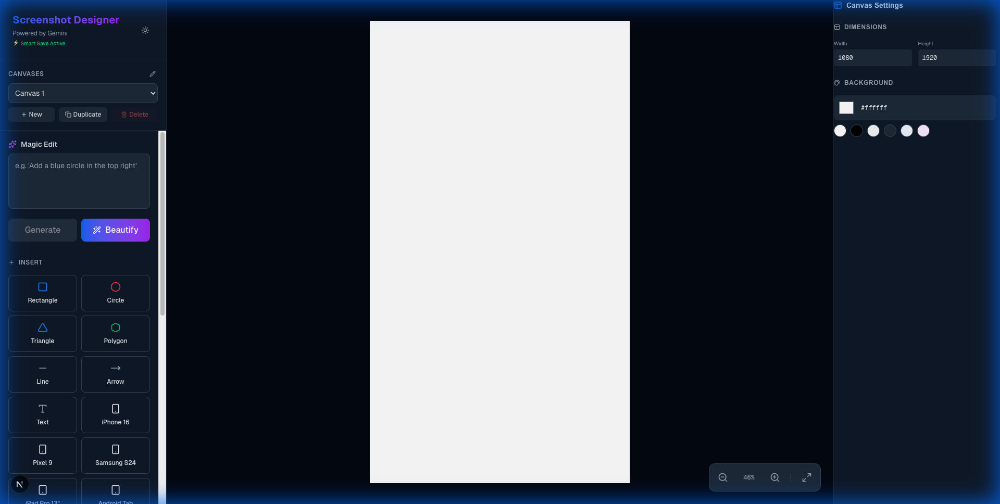

# Screenshot Designer

A powerful web-based tool for creating professional App Store and Play Store screenshots. Built with Next.js, Fabric.js, and Tailwind CSS.



## Features

- **Device Frames**: High-quality vector frames for the latest devices:
    - iPhone 16 Pro & Max
    - Google Pixel 9
    - Samsung Galaxy S24 Ultra
    - iPad Pro 13"
    - Android Tablet
- **Smart Design Tools**:
    - **Shapes**: Rectangle, Circle, Triangle, Polygon
    - **Connectors**: Arrows and Lines for annotating flows
    - **Text**: Rich text editing with various fonts and styles
- **Canvas Management**:
    - **Multi-Canvas Support**: Create, duplicate, and manage multiple screenshot designs in one session.
    - **Presets**: One-click resizing for iOS (6.5", 5.5") and Android (Phone, 7" Tablet, 10" Tablet).
    - **Custom Backgrounds**: Choose from preset colors or define custom HEX values.
- **Export**: High-resolution PNG export for immediate store upload.
- **Theme Support**: Fully responsive Light and Dark modes.

## Getting Started

Follow these instructions to set up the project locally.

### Prerequisites

- Node.js (v18 or higher)
- npm or yarn

### Installation

1. Clone the repository:
   ```bash
   git clone https://github.com/juliuscanute/play-and-app-screenshots.git
   cd play-and-app-screenshots
   ```

2. Install dependencies:
   ```bash
   npm install
   # or
   yarn install
   ```

### Running Locally

Start the development server:

```bash
npm run dev
```

Open [http://localhost:3000](http://localhost:3000) in your browser.

### Building for Production

To create a production build:

```bash
npm run build
```

Start the production server:

```bash
npm start
```

## User Interface

The application features a streamlined three-column layout:

1.  **Toolbox (Left Sidebar)**:
    -   **Canvases**: Manage your distinct screenshot screens.
    -   **Insert**: Drag and drop text, shapes, and device frames.
    -   **Size**: Quickly switch between standard App Store and Play Store dimensions.
    -   **Actions**: Save project state or Export final images.

2.  **Editor (Center)**:
    -   The main workspace where you arrange your elements.
    -   Includes zoom controls and "Fit to Screen" functionality for easy navigation.

3.  **Properties (Right Sidebar)**:
    -   **Canvas Settings**: When no object is selected, adjust canvas width, height, and background color.
    -   **Object Settings**: When an object is selected, customize its properties (color, border, text style, etc.).

## Tech Stack

- **Framework**: [Next.js 15](https://nextjs.org/) (App Directory)
- **Styling**: [Tailwind CSS](https://tailwindcss.com/)
- **Canvas Engine**: [Fabric.js](http://fabricjs.com/)
- **State Management**: [Zustand](https://github.com/pmndrs/zustand)
- **Icons**: [Lucide React](https://lucide.dev/)
