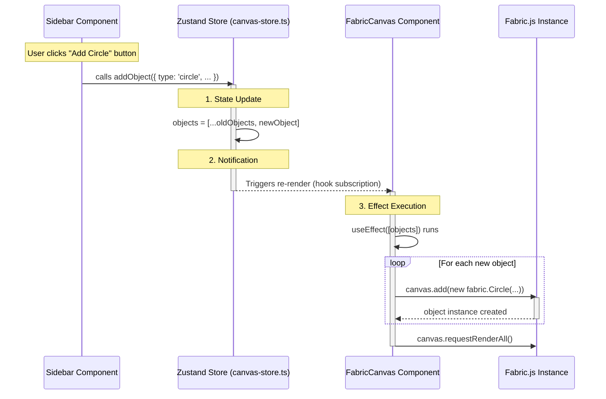

# State Flow Visualization

This diagram illustrates the precise flow when `addObject` is called, showing how data moves from the UI component through the Zustand store and triggers updates in the Canvas component.

## detailed Steps

1.  **Direct Call**: The `Sidebar` component directly imports and calls the `addObject` function exposed by the `useCanvasStore` hook.
2.  **Immutability**: Inside `canvas-store.ts`, the `set` function is used. Crucially, it creates a *new array* (`[...state.objects, object]`) rather than mutating the existing one. This is what signals to React that "something changed".
3.  **Subscription**: `FabricCanvas.tsx` calls `const { objects } = useCanvasStore()`. This creates a subscription. When the `objects` reference changes in the store, React forces `FabricCanvas` to re-render.
4.  **Reaction**: The `useEffect` inside `FabricCanvas` has `[objects]` as a dependency, so it runs immediately after the re-render, synchronizing the visual canvas with the new state.
